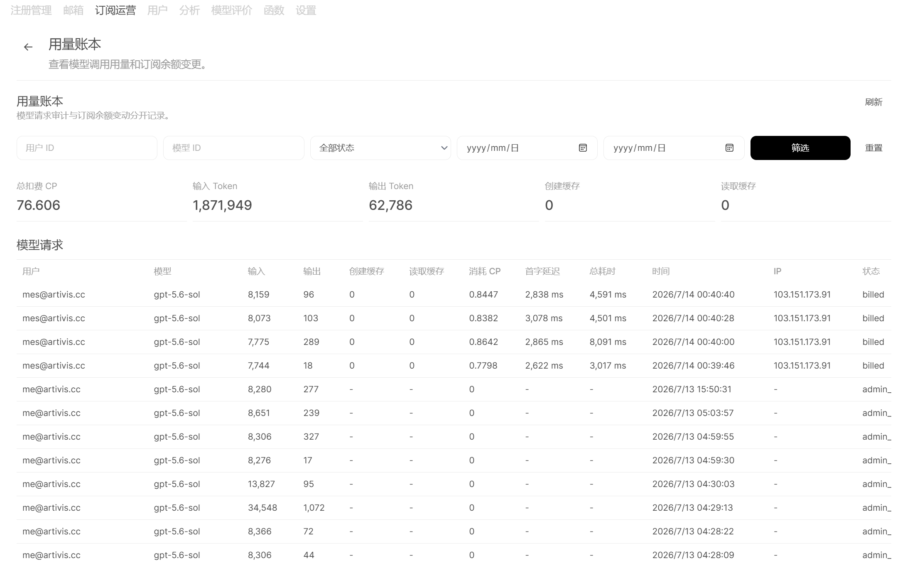
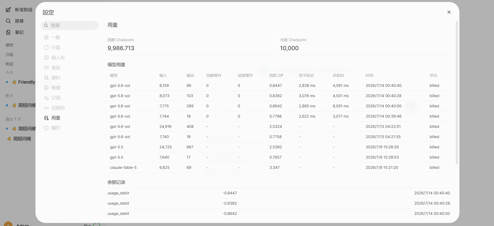
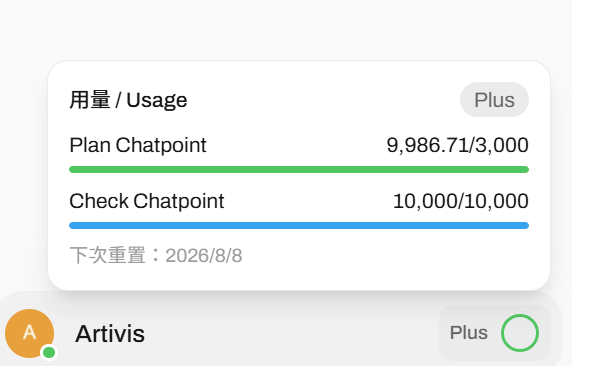

<p align="center"></p>

# ArtiChat

**ArtiChat 是一个可私有化部署的 AI 对话平台，支持接入多种大模型，开箱即用，数据自主可控。**

它基于 <a href="https://github.com/open-webui/open-webui">OpenWebUI</a> ，是一个可以完全离线运行，兼容 OpenAI 风格 API ，内置检索增强（RAG）、多用户与权限管理、插件扩展等能力，适合团队与个人搭建自己的 AI 工作台。
> 以 OpenWebUI 0.10.2 作为二次开发版本
> Powered By Artivis Studio | <a href="https://chat.artivis.cc">Web ArtiChat</a>


## 核心功能

- **上游兼容**：保留原OpenWebUI的全部功能，但是剔除了Ollama功能。
- **订阅与用量**：支持订阅计划、Chatpoint 额度、四类 Token 计价和用量审计。


> 定价方式已重写，改为类似模型官方API四类定价（输入/输出/创缓/读缓）

- **用户与权限**：支持角色访问控制（RBAC）、用户组、管理员用户管理和细粒度模型权限。
- **注册与邮件**：支持注册域名限制、邮箱验证码登录、密码重置、SMTP 和邮件模板管理。
- **兑换码/礼品卡**: 新增兑换码功能，可以发放订阅/余额，并且加入礼品卡，可以直接给特定用户发放或是全体用户。
- **公告系统**: 增添公告系统，可以给全体or特定的用户组发放一次/每次登录等公告。（！已知UI美观问题将于0.1.4版本修复）
- **平台自定义**：搭建后包括平台名称、LOGO资源、关于页面均可自定义修改。
- **用量管理**：管理员后台/用户后台可以清晰的得知用量信息，管理员端可见用户IP。




> 用户用量用环状图显示，包括两种Point，订阅分配的可以月刷新的Point以及充值的不参与重置的Point。优先使用可刷新Point。

## 未来企划（计划的0.2版本更新与开发）
- Github 开源了 Claude Code 的代码，我将二次开发为 ArtiCode （开源Agent工具，已在内测）。
- ArtiCode 将 ArtiChat 的账号、额度系统，让人人都能拥有自己的Agent软件并分化使用（画饼ing）。
- ArtiCode 数据（Token）将从 ArtiChat 的根服务器传输并且计费，请求直接打到上游或是你自己的Ollama，相当于为每个用户开通了独立的API（类中转站）服务。
- 本项目配合 Sub2API/CLIProxyAPI/NewAPI/ChatGPT2API 等项目达到最佳。本项目不做号池服务。

## 技术栈

| 层 | 技术 |
| --- | --- |
| 前端 | SvelteKit · TypeScript · Tailwind CSS · Vite |
| 后端 | Python · FastAPI · SQLAlchemy |
| 部署 | Docker · Docker Compose |

## 快速开始

推荐使用 Docker 部署，可将运行环境与主机隔离，免去本地依赖配置。

### 方式一：Docker Compose（推荐）

```bash
git clone https://github.com/PYBu/ArtiChat.git
cd ArtiChat

# 构建并启动 ArtiChat
docker compose -p artichat up -d --build artichat
```

启动后访问 [http://localhost:3000](http://localhost:3000)，首次进入即可完成管理员账号初始化。

健康检查：

```bash
curl http://localhost:3000/health
# {"status":true}
```

> 默认将主机 `3000` 端口映射到容器内 `8080` 端口，可通过环境变量 `ARTICHAT_PORT` 修改主机端口。Compose 只运行 ArtiChat；如需使用 Ollama，请连接主机或其他服务器上已有的 Ollama 服务。

### 方式二：本地开发

需要 **Node.js `>=18.13 <=22`** 与 **Python 3.11+**。

前端：

```bash
npm install
npm run dev
npm run build
```

后端：

```bash
cd backend
pip install -r requirements.txt
bash start.sh
```

## 配置

复制示例环境文件并按需修改：

```bash
cp .env.example .env
```

常用环境变量：

| 变量 | 说明 |
| --- | --- |
| `OPENAI_API_BASE_URL` | OpenAI 兼容 API 地址 |
| `OPENAI_API_KEY` | 对应 API 密钥 |
| `OLLAMA_BASE_URL` | 本地 Ollama 服务地址 |
| `WEBUI_SECRET_KEY` | 会话及敏感配置加密密钥，生产环境务必设置并保持稳定 |
| `CORS_ALLOW_ORIGIN` | 允许的跨域来源，生产环境应收紧 |
| `ARTICHAT_PORT` | Docker 部署时映射到主机的端口 |

> 生产部署请务必设置稳定的 `WEBUI_SECRET_KEY`，并将 `CORS_ALLOW_ORIGIN` 从默认的 `*` 收紧为实际来源域名。

## 目录结构

```text
ArtiChat/
├── src/                 # 前端（SvelteKit）
├── backend/             # 后端（FastAPI）
├── static/              # 静态资源与品牌图标
├── artivis-ass/         # ArtiChat 品牌与文档资产
├── scripts/             # 构建与工具脚本
├── docs/                # 安全说明、知识文本与发布说明
├── docker-compose.yaml  # Docker 编排
└── Dockerfile
```

## 第三方许可

第三方版权与许可信息保留在 [`LICENSE`](LICENSE)、[`LICENSE_NOTICE`](LICENSE_NOTICE) 与 [`LICENSE_HISTORY`](LICENSE_HISTORY) 中。

## 许可证

本项目沿用上游的多许可证约定，详见 [`LICENSE`](LICENSE) 与 [`LICENSE_NOTICE`](LICENSE_NOTICE)。使用与分发前请阅读相关许可条款。
本项目并未获得OpenWebUI的商用许可证，若您的部署用户超过50人或用于商业请移步OpenWebUI官方获取商用版权，本项目品牌&样式仅作参考。
致谢OpenWebUI项目组的开源。

## 推荐社区
<a href="https://linux.do/">LinuxDo</a> | 本软件无任何版权，仅为个人（代表Artivis团队）二次开发且维护分享，商用请申请 OpenWebUI 的商用许可！
