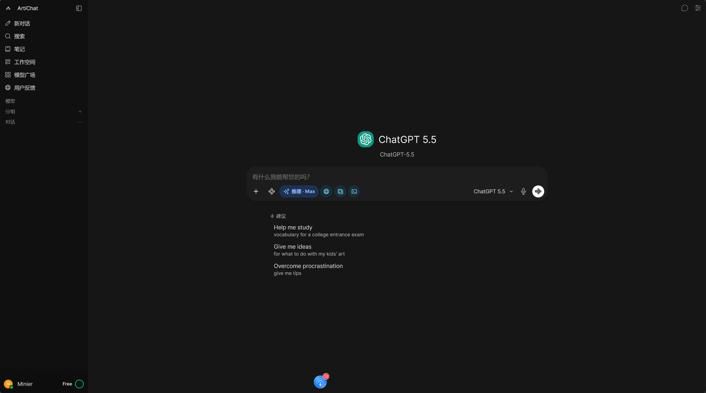
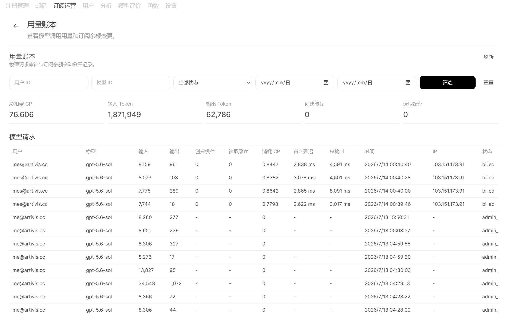
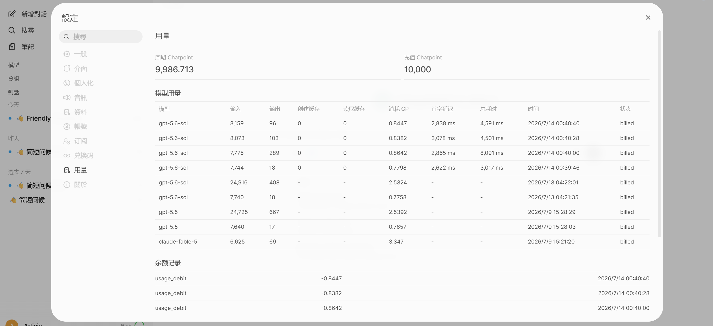
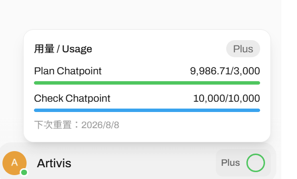

目前正在升级ArtiChat0.2.0，在保证与0.1版本无缝更新的前提下推送更新并删除此条。

<p align="center"></p>

# ArtiChat

**ArtiChat 可私有化部署的功能丰富的AI对话平台。**

This is ArtiChat ProEdition 0.2+
<br>
它基于 <a href="https://github.com/open-webui/open-webui">OpenWebUI</a> 但拥有更多丰富功能且以运营与用户体验为主的AI对话工作台。
> 以 OpenWebUI 0.11.0 作为二次开发版本（ArtiChat 0.2+）
> Powered By Artivis Studio | <a href="https://chat.artivis.cc">Web ArtiChat</a> | <a href="https://chatbug.artivis.cc">访问ArtiChat 反馈中心</a>




## 核心功能 Features

> [!TIP]  
> **核心功能承接 ArtiChat 0.1+ 版本**
>
> 保留原版功能的前提下并且兼容 **旧版 ArtiChat** ，做到无缝衔接更新！

- **✅️ 原版兼容 / Original Compatibility**
  保留原 OpenWebUI 绝大部分功能，同时移除了部分冗余 UI 元素及 Ollama 相关内容。
> Retains nearly all core features of the original OpenWebUI, while removing certain redundant UI elements and Ollama-specific content.

- **🏛️ 订阅与用量 / Subscriptions & Usage**
  支持订阅计划、Chatpoint 额度、四类 Token 计价模式以及完整的用量审计功能。
> Supports subscription plans, Chatpoint quotas, four token pricing models, and comprehensive usage auditing.


> 定价方式已重写，改为类似模型官方API四类定价（输入/输出/创缓/读缓）

- **🎈 用户与权限 / Users & Permissions**
  支持角色访问控制（RBAC）、用户组、管理员用户管理和细粒度模型权限。
  > Supports role-based access control (RBAC), user groups, admin user management, and fine-grained model permissions.
- **☂️ 注册与邮件 / Registration & Email**
  支持注册域名限制、邮箱验证码登录、密码重置、SMTP 配置和邮件模板管理。
  > Supports domain-restricted registration, email verification code login, password reset, SMTP configuration, and email template management.
- **🎟️ 兑换码 / 礼品卡 / Redemption Codes & Gift Cards**
  新增兑换码功能，可发放订阅或余额；礼品卡支持向特定用户或全体用户发放。
  > Introduces redemption codes for granting subscriptions or credits, plus gift cards that can be issued to specific users or all users.
- **🖼️ 公告系统 / Announcement System**
  可向全体或特定用户组发布一次性或每次登录时的公告。
  > Supports sending one-time or login-triggered announcements to all users or specific user groups.
- **☄️ 平台自定义 / Platform Customization**
  平台名称、LOGO 资源、关于页面均可自定义修改。
  > Platform name, logo assets, and the About page are all fully customizable after deployment.
- **🌈 用量管理 / Usage Management**
  管理员后台与用户后台均可清晰查看用量信息，管理员端可见用户 IP。
  > Both admin and user dashboards provide clear usage statistics; admin panel also displays user IP addresses.
- **🎁 模型广场 / Model Marketplace**
  将支持的模型列出并展示定价、访问权限及介绍等信息。
  > Lists all supported models with their pricing, access permissions, and descriptions.
- **🪄 推理强度 / Inference Intensity**
  新增推理强度选择，支持 Codex 与 Claude 的 5 档强度：Low、Mid、High、XHigh、Max。
  > Adds inference intensity selection with 5 levels — Low, Mid, High, XHigh, and Max — for both Codex and Claude models.
- **🎹 后续功能 / Upcoming Features**
  ArtiChat 持续听取社区意见，不断更新迭代。欢迎提交 Bug 反馈与功能建议！
  > ArtiChat continuously evolves based on community feedback. Bug reports and feature suggestions are always welcome!

  <br>
  





<br>
> 采用类Codex、Claude的桌面端的推理强度弹窗滑块以及动效。

> 用户用量用环状图显示，包括两种Point，订阅分配的可以月刷新的Point以及充值的不参与重置的Point。优先使用可刷新Point。

<br>


- **🖌️New 文件管理**：新增文件管理器，可以查看用户上传的文件，并进行管理。
  
- **🖌️New 新的UI**：ArtiChat新增组件UI重构，更加服务用户体验，并且准备重构原本UI。


## 未来企划（计划的0.2.x版本更新与开发）
- **💽ArtiLINK (本地MCP连接)** - 一个内置在ArtiChat随着部署打包好的本地服务，用于与ArtiChat建立通道，让模型能够控制本地的PowerShell、MCP以及管理员权限，做到类似“网页Codex”的效果。

<br><br><hr>


## 快速反馈
- **🎺ArtiChat 服务拥有提交反馈的入口，用户的需求、Bug反馈、改进建议都可以在此提交，并且公开项目进度。**
- **chatbug.artivis.cc | <a href="https://chatbug.artivis.cc">访问ArtiChat 反馈中心</a>**

<br><br><br><br>
<hr>
## 部署方法已验证。后续我会尝试做一个一键部署的脚本，简化部署流程。

> 建议使用Codex或Claude一键部署，并声明你用的面板和不影响当前服务

> 例子：{服务器ip和ssh密钥地址} 这是我的服务器ip以及我的SSH密钥，帮我部署 https://github.com/PYBu/ArtiChat 这个项目，我用的是 1panel 面板，请不要影响其它正在运行的服务。

## 技术栈

| 层 | 技术 |
| --- | --- |
| 前端 | SvelteKit · TypeScript · Tailwind CSS · Vite |
| 后端 | Python · FastAPI · SQLAlchemy |
| 部署 | Docker · Docker Compose |

## 快速开始

推荐使用 Docker 部署，可将运行环境与主机隔离，免去本地依赖配置。

### 方式一：Docker Compose（推荐）

```bash
git clone https://github.com/PYBu/ArtiChat.git
cd ArtiChat

# 构建并启动 ArtiChat
docker compose -p artichat up -d --build artichat
```

启动后访问 [http://localhost:3000](http://localhost:3000)，首次进入即可完成管理员账号初始化。

健康检查：

```bash
curl http://localhost:3000/health
# {"status":true}
```

> 默认将主机 `3000` 端口映射到容器内 `8080` 端口，可通过环境变量 `ARTICHAT_PORT` 修改主机端口。Compose 只运行 ArtiChat；如需使用 Ollama，请连接主机或其他服务器上已有的 Ollama 服务。

### 方式二：本地开发

需要 **Node.js `>=18.13 <=22`** 与 **Python 3.11+**。

前端：

```bash
npm install
npm run dev
npm run build
```

后端：

```bash
cd backend
pip install -r requirements.txt
bash start.sh
```

## 配置

复制示例环境文件并按需修改：

```bash
cp .env.example .env
```

常用环境变量：

| 变量 | 说明 |
| --- | --- |
| `OPENAI_API_BASE_URL` | OpenAI 兼容 API 地址 |
| `OPENAI_API_KEY` | 对应 API 密钥 |
| `OLLAMA_BASE_URL` | 本地 Ollama 服务地址 |
| `WEBUI_SECRET_KEY` | 会话及敏感配置加密密钥，生产环境务必设置并保持稳定 |
| `CORS_ALLOW_ORIGIN` | 允许的跨域来源，生产环境应收紧 |
| `ARTICHAT_PORT` | Docker 部署时映射到主机的端口 |

> 生产部署请务必设置稳定的 `WEBUI_SECRET_KEY`，并将 `CORS_ALLOW_ORIGIN` 从默认的 `*` 收紧为实际来源域名。

## 目录结构

```text
ArtiChat/
├── src/                 # 前端（SvelteKit）
├── backend/             # 后端（FastAPI）
├── static/              # 静态资源与品牌图标
├── artivis-ass/         # ArtiChat 品牌与文档资产
├── scripts/             # 构建与工具脚本
├── docs/                # 安全说明、知识文本与发布说明
├── docker-compose.yaml  # Docker 编排
└── Dockerfile
```

## 第三方许可

第三方版权与许可信息保留在 [`LICENSE`](LICENSE)、[`LICENSE_NOTICE`](LICENSE_NOTICE) 与 [`LICENSE_HISTORY`](LICENSE_HISTORY) 中。

## 许可证

本项目沿用上游的多许可证约定，详见 [`LICENSE`](LICENSE) 与 [`LICENSE_NOTICE`](LICENSE_NOTICE)。使用与分发前请阅读相关许可条款。
若您的部署用户超过50人或用于商业请移步OpenWebUI官方获取商用版权。
致谢OpenWebUI项目组的开源。

## 推荐社区
<a href="https://linux.do/">LinuxDo</a> | ArtivisCom [装修中未开放]
