<div align="center">


# ArtiChat

[](https://github.com/PYBu/ArtiChat/)

**企业级私有化定制的 AI 对话平台**

<kbd>开箱即用</kbd> &nbsp; <kbd>订阅计费</kbd> &nbsp; <kbd>体验优化</kbd> &nbsp; <kbd>企业适用</kbd> &nbsp; <kbd>原版优化</kbd>

<br/>

[](https://github.com/PYBu/ArtiChat/releases)
[](https://github.com/open-webui/open-webui)
[](https://www.docker.com/)
[](https://kit.svelte.dev/)
[](https://fastapi.tiangolo.com/)

[](https://chat.artivis.cc)

</div>

<br/>

> 当前稳定版本为 **ArtiChat ProEdition 0.2.4**。本版本已验证从 0.1.7 直接升级，无需安装中间版本。升级会自动执行数据库迁移；生产环境升级前请先停止服务并备份 `artichat_data`，旧版 0.1.7 不可直接连接已经迁移到 0.2.4 的数据卷。

## 简介

ArtiChat 是由 **Artivis Studio** 基于 [OpenWebUI 0.11.0](https://github.com/open-webui/open-webui) 深度定制的私有 AI 对话平台。在保留 OpenWebUI 强大对话能力的基础上，ArtiChat 引入了完整的**订阅计费体系**、**用户权限管理**和**用户体验优化**，帮助团队或 SaaS 产品快速搭建一套自主可控的 AI 服务，适用于绝大多数的大模型分发计费商业化以及企业、团队内部模型的使用。

> ⚠️ **商业部署须知** — 超过 50 名用户或用于商业用途，请遵循 [OpenWebUI 许可协议](https://github.com/open-webui/open-webui/blob/main/LICENSE) 并向 OpenWebUI 官方获取授权。

<br/>

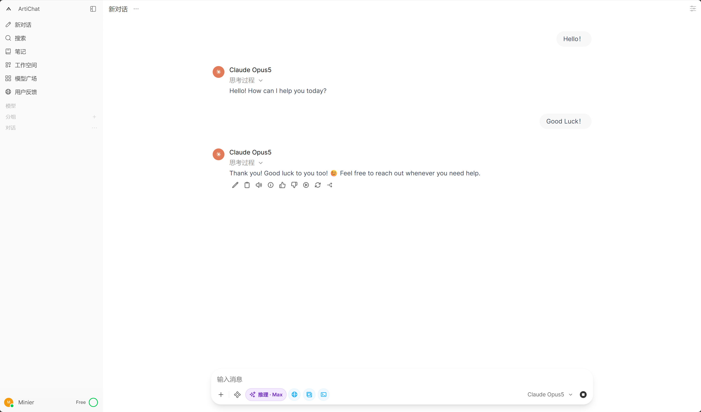

---

<br/>

<table>
<tr>
<td width="50%" valign="top">

**💳 &nbsp;订阅计费系统**

四类 Token 精细计价，覆盖推理全链路成本：

- **Input** · **Output** · **Cache Create** · **Cache Read**
- 礼品卡 & 兑换码发放与核销
- 用量审计，消费明细随时可查

</td>
<td width="50%" valign="top">

**⚡ &nbsp;推理强度调节**

针对高阶模型的智能调度控制：

- 五档强度：**Low → Balanced → High → Ultra → Max**
- 专为Claude 与 Codex 系列优化
- 一键切换，无需修改任何配置

</td>
</tr>
<tr>
<td width="50%" valign="top">

**👥 &nbsp;权限管理（RBAC）**

灵活的多级角色体系，精准控制访问边界：

- 多级用户组与角色分配
- 邮箱验证注册流程
- 模型与功能的细粒度权限控制

</td>
<td width="50%" valign="top">

**🛒 &nbsp;模型市场**

统一的模型入口，清晰呈现资源信息：

- 集中展示全部可用模型
- 显示各模型定价与访问条件
- 用户自助完成模型套餐订阅

</td>
</tr>
<tr>
<td width="50%" valign="top">

**🎨 &nbsp;白标定制**

部署即品牌，零代码完成外观替换：

- 平台名称、Logo 可视化配置
- About 页面内容完全自定义
- 适合 SaaS 独立品牌化运营

</td>
<td width="50%" valign="top">

**🐳 &nbsp;开箱即用**

极简部署，专注业务而非运维：

- 单命令 Docker Compose 启动
- 已移除 Ollama 依赖，镜像更轻量
- SvelteKit + FastAPI + SQLAlchemy 全栈

</td>
</tr>

<tr>
<td width="50%" valign="top">

**🧩 &nbsp;插件中心 ACPlugin**

为模型装上可调用的工具，能力边界由你定义：

- 支持自制插件上传即用，无需改动主程序代码
- 内置 **ACPlugin** 目录：Artivis 官方插件 + 已认证社区插件，一键安装
- 插件专用于模型工具（Tools），由模型在对话中按需调用

</td>
<td width="50%" valign="top">

**📦 &nbsp;镜像分发**

已上传至 GHCR 与 DockerHub，拉取即部署：

- 官方镜像已发布，无需本地构建
- 单条 `docker pull` 命令完成拉取
- [GHCR](https://github.com/PYBu/ArtiChat/pkgs/container/artichat) · [DockerHub](https://hub.docker.com/r/minier/artichat)

</td>
</tr>

</table>

---

## 📸 &nbsp;界面预览

<br/>

<table>
<tr>
<td width="50%">

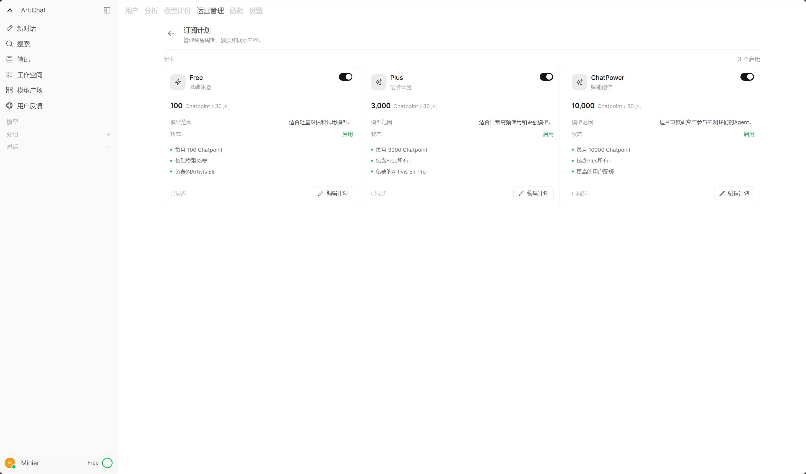

</td>
<td width="50%">

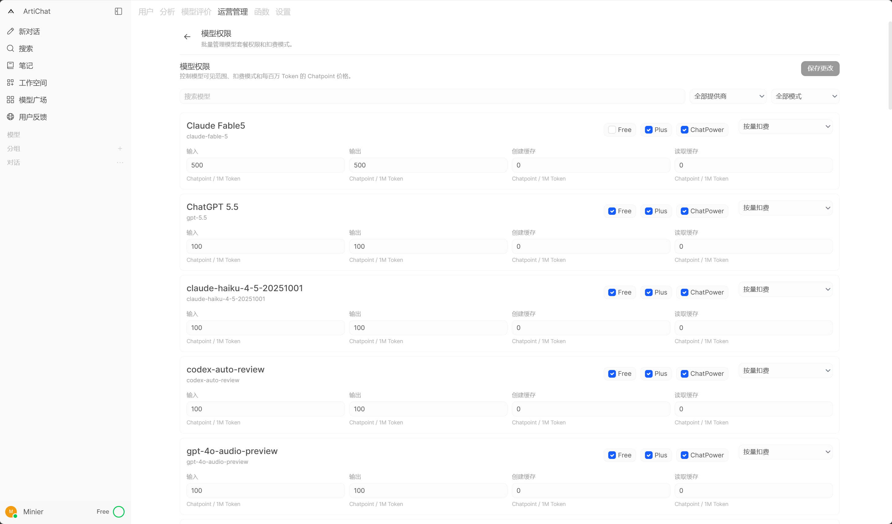

</td>
</tr>
<tr>
<td width="50%">

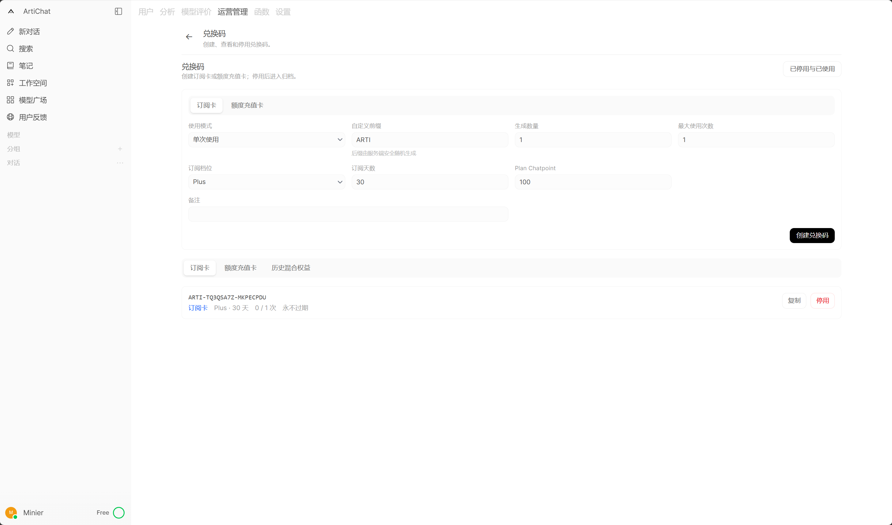

</td>
<td width="50%">

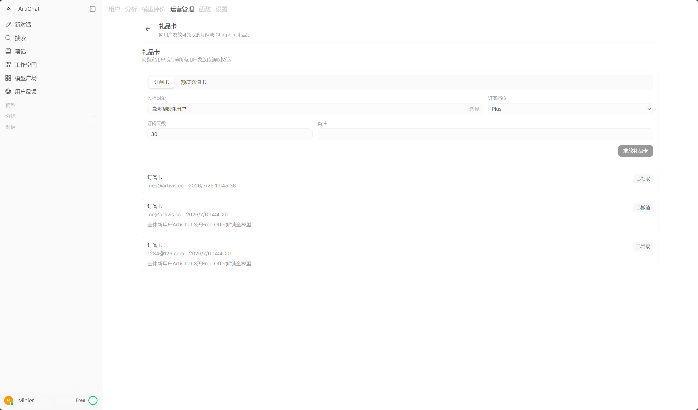

</td>
</tr>
<tr>
<td width="50%">

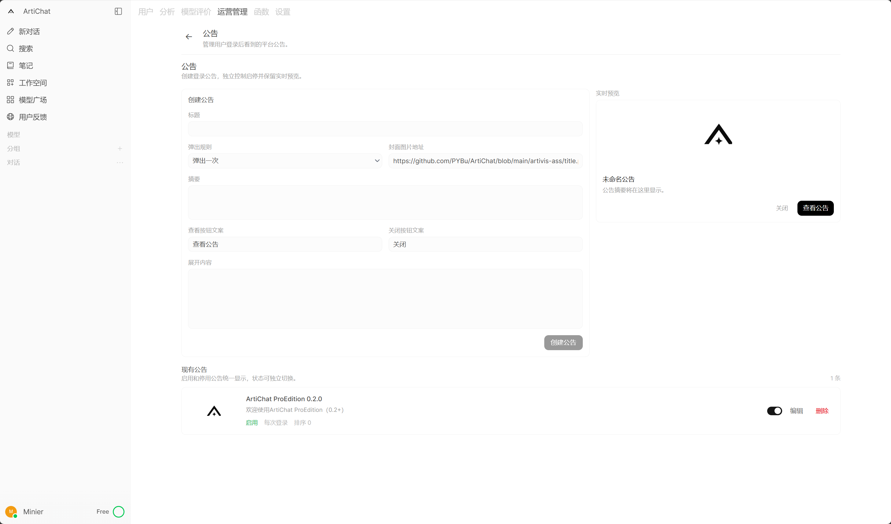

</td>
<td width="50%">

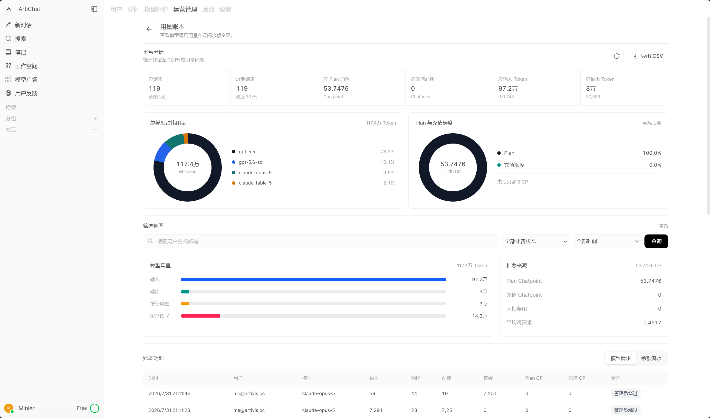

</td>
</tr>
</table>

<br/>

<table>
<tr>
<td width="50%">

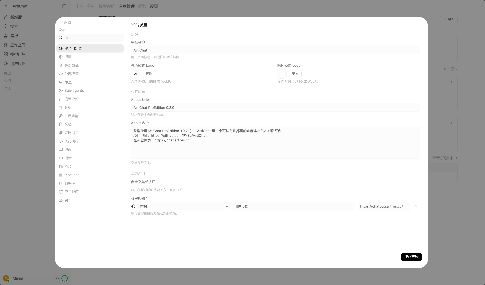

</td>
<td width="50%">

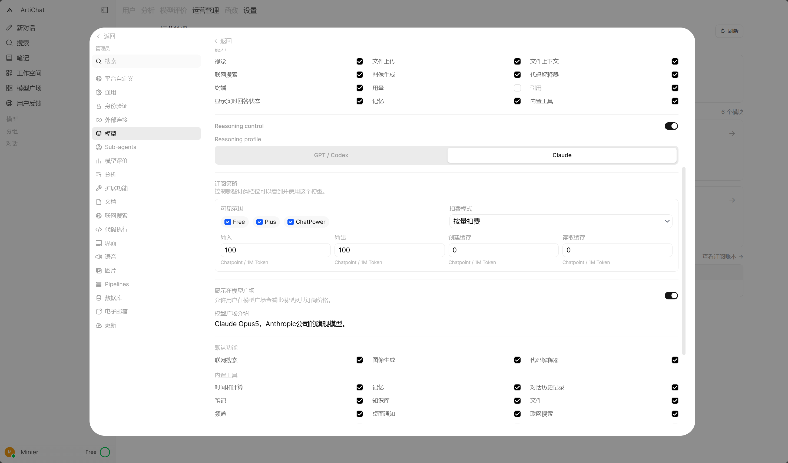

</td>
</tr>
<tr>
<td width="50%">

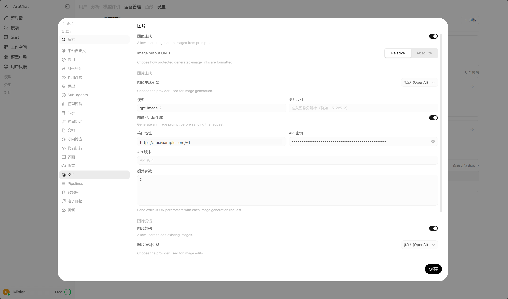

</td>
<td width="50%">

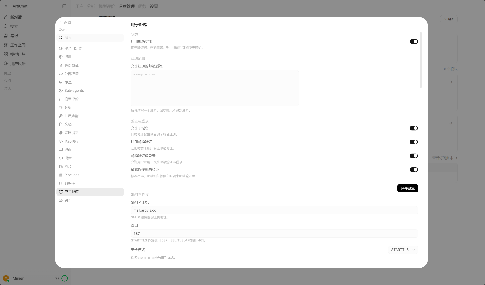

</td>
</tr>
</table>

<br/>

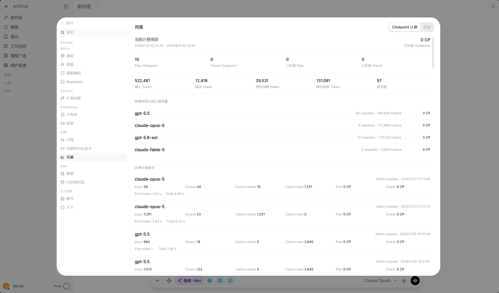

<br/>

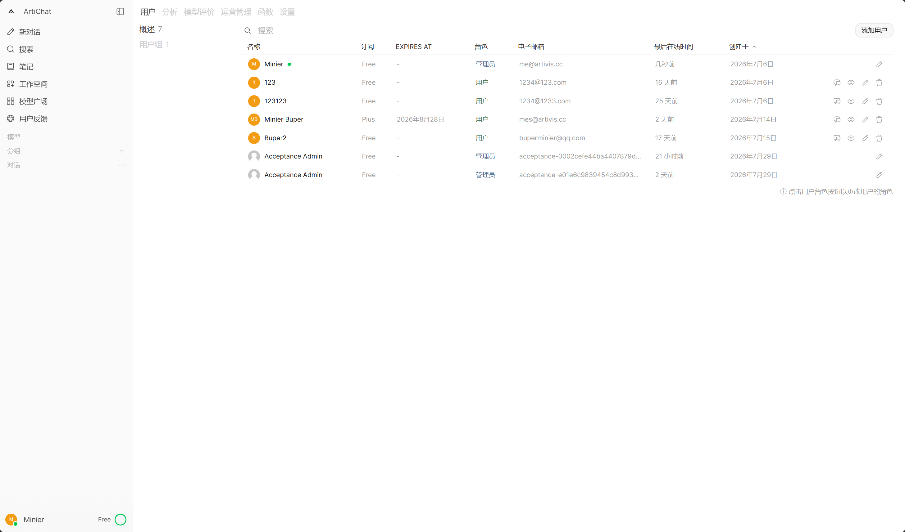

<br/>

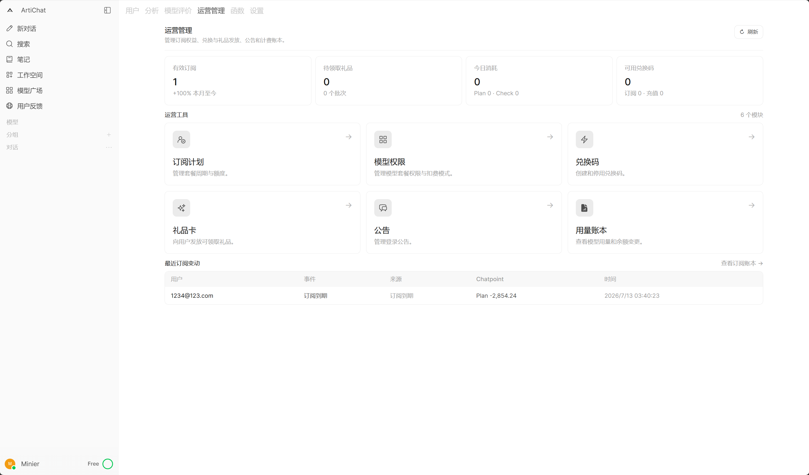

<br/>

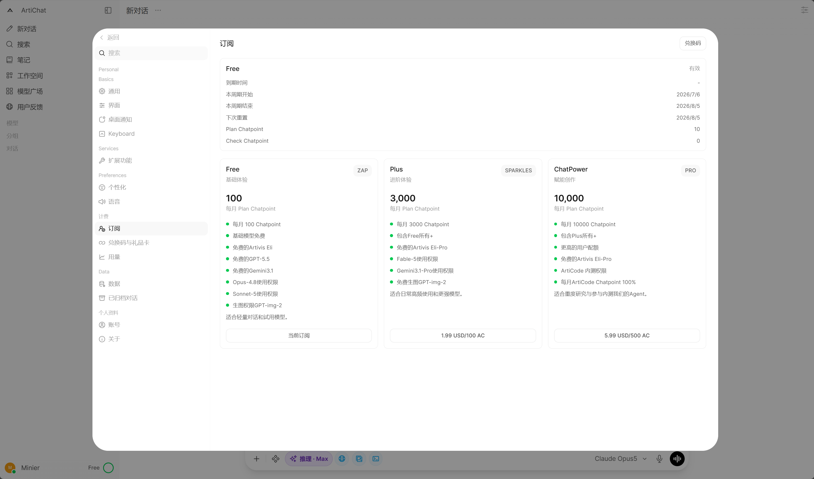

<br/>

---

## 🎨 &nbsp;设计小巧思

为每一处小细节增添一丝丝设计乐趣。

<br/>

<table>
<tr>
<td width="50%" align="center" valign="top">

**环状额度组件**

直观呈现剩余额度，一眼掌握用量状态。
<br>
 -来自 Minier Buper 的建议。


</td>
<td width="50%" align="center" valign="top">

**思考强度动画**

五档强度切换配合流畅过渡动效，操作即反馈。
<br>
 -学习 Codex /CC 的强度动画。

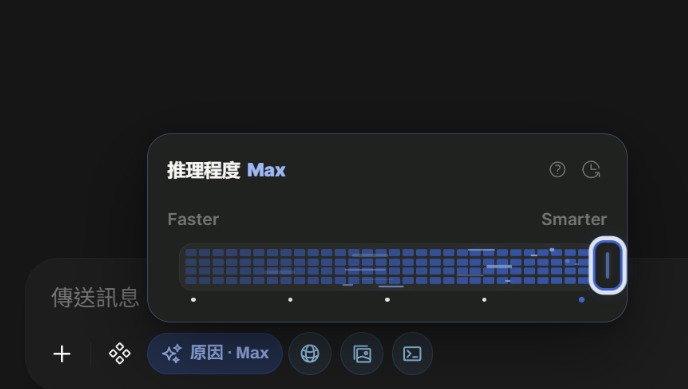

</td>
</tr>
</table>

<br/>

---

## 💬 &nbsp;参与反馈

ArtiChat 的每一次迭代都来自用户的真实声音。如果你遇到了Bug、有新功能想法，或者只是想聊聊使用体验——欢迎到反馈站告诉我们，我们很期待社区以及用户的声音！本项目历经 0.1 到 0.2 的系统性升级，可能存在不少Bug，但是我依旧会坚持更新（感情牌）！

<div align="center">

<br/>

[](https://chatbug.artivis.cc)

<br/>

</div>

---

## 🚀 &nbsp;快速部署

### 环境要求

| 依赖 | 版本要求 |
|:-----|:--------|
| Docker | 20.10+ |
| Docker Compose | v2.x（可选，仅 Compose 部署需要） |
| 服务器内存 | ≥ 2 GB（推荐 4 GB+） |
| 网络 | 可访问目标 AI API |

<br/>

### 方案一：官方镜像（推荐）

镜像已发布到 GHCR 与 DockerHub，无需克隆仓库、无需本地构建，拉取即用。两个仓库是同一份镜像，任选其一：

| 仓库 | 镜像地址 |
|:-----|:--------|
| GHCR | `ghcr.io/pybu/artichat:latest` |
| DockerHub | `minier/artichat:latest` |

```bash
docker run -d \
  --name artichat \
  -p 3000:8080 \
  -v artichat_data:/app/backend/data \
  -e OPENAI_API_BASE_URL=https://your-api-endpoint/v1 \
  -e OPENAI_API_KEY=sk-xxxxxx \
  --restart unless-stopped \
  ghcr.io/pybu/artichat:latest
```

也可以用 Compose，新建一个 `docker-compose.yaml`：

```yaml
services:
  artichat:
    image: ghcr.io/pybu/artichat:latest
    container_name: artichat
    ports:
      - "3000:8080"
    volumes:
      - artichat_data:/app/backend/data
    environment:
      - OPENAI_API_BASE_URL=https://your-api-endpoint/v1
      - OPENAI_API_KEY=sk-xxxxxx
    restart: unless-stopped

volumes:
  artichat_data:
```

```bash
docker compose -p artichat up -d
```

> 💡 `latest` 始终指向最新稳定版。生产环境如需固定版本，把标签换成具体版本号（如 `:0.2.2`）即可，方便回滚。升级只需拉取新标签并重建容器，`artichat_data` 数据卷会自动保留。

<br/>

### 方案二：源码构建

需要自行修改代码时使用，首次构建约需 3–5 分钟：

```bash
# 1. 克隆仓库
git clone https://github.com/PYBu/ArtiChat.git
cd ArtiChat

# 2. 构建并启动
docker compose -p artichat up -d --build artichat
```

<br/>

### 启动后

访问 **[http://localhost:3000](http://localhost:3000)**，首次进入即可完成管理员账号初始化。

健康检查：

```bash
curl http://localhost:3000/health
# {"status":true}
```

<br/>

### 从 0.1.7 升级

0.2.2 支持从已发布的 0.1.7 直接升级。无论用哪种方式部署，都请先停止写入并备份命名卷：

```bash
docker compose -p artichat stop artichat
docker run --rm \
  -v artichat_data:/source:ro \
  -v "$PWD":/backup \
  alpine sh -c 'tar -C /source -czf /backup/artichat-0.1.7-backup.tar.gz .'
```

备份完成后，按部署方式选择对应的升级命令。

镜像部署：

```bash
docker compose -p artichat pull
docker compose -p artichat up -d
curl http://localhost:3000/ready
```

源码部署：

```bash
git pull --ff-only origin main
docker compose -p artichat up -d --build artichat
curl http://localhost:3000/ready
```

确认 `/ready` 返回 `{"status":true}` 后再恢复外部流量。需要回滚时，请把升级前归档恢复到一个干净数据卷后再启动 0.1.7；不要让 0.1.7 直接读取已经迁移到 0.2.2 的数据卷。

<br/>

### 生产环境配置

| 参数 | 说明 | 默认值 |
|:-----|:-----|:------|
| `WEBUI_SECRET_KEY_FILE` | 持久化会话密钥文件 | `/app/backend/data/.webui_secret_key` |
| `WEBUI_SECRET_KEY` | 可选的显式会话密钥；设置后需长期保持不变 | 未设置 |
| `CORS_ALLOW_ORIGIN` | 跨域来源白名单 | `*`（不安全） |
| `DATABASE_URL` | 数据库连接字符串 | SQLite 本地文件 |
| `OPENAI_API_BASE_URL` | OpenAI 兼容 API 地址 | — |
| `OPENAI_API_KEY` | 对应 API 密钥 | — |

> 💡 Docker Compose 默认会在数据卷内生成并复用会话密钥文件。生产环境务必持久化该文件或设置长期不变的 `WEBUI_SECRET_KEY`，并将 `CORS_ALLOW_ORIGIN` 从默认的 `*` 收紧为实际域名。

<br/>

---

## 🗺️ &nbsp;重要更新节点

```
v0.1.3  ✅  完整重建 ArtiChat 内容，最为分支区分于 OpenWebUI 。
v0.1.7  ✅  底层适配与修改，加固与 ArtiChat 稳定运行。
v0.2.0  ✅  系统性升级，重建 ArtiChat 组件与 UI，以新功能与用户体验作为优先更新动力。
v0.2.2  ✅  插件中心（ACPlugin），支持上传或使用Artivis或社区提供的插件。

v0.3.0  🔜  ArtiLINK — 本地 MCP 接入，让模型直接操控 PowerShell 与本地系统资源，实现真正意义上的「网页版 Codex」
```

<br/>

---

## 🛠️ &nbsp;技术栈

<div align="center">

| 层级 | 技术选型 |
|:----:|:--------|
| **前端** | SvelteKit · TypeScript · Tailwind CSS · Vite |
| **后端** | FastAPI · SQLAlchemy · Python 3.11+ |
| **基础平台** | OpenWebUI 0.11.0 |
| **容器化** | Docker · Docker Compose |

</div>

<br/>

---

## 🙏 &nbsp;致谢

感谢以下项目与社区对 ArtiChat 的支持与启发：

[**OpenWebUI**](https://github.com/open-webui/open-webui) — ArtiChat 的基础平台，提供了强大的对话界面与工程底座

[**Linux.Do 社区**](https://linux.do) — 感谢社区成员的反馈、讨论与持续支持

<br/>

---

## 📄 &nbsp;开源声明

本项目基于 [OpenWebUI](https://github.com/open-webui/open-webui) 进行二次开发，遵循其许可协议。上游版权与许可信息保留在 [`LICENSE`](LICENSE)、[`LICENSE_NOTICE`](LICENSE_NOTICE) 与 [`LICENSE_HISTORY`](LICENSE_HISTORY) 中。**超过 50 名用户的部署或任何商业用途，请直接联系 OpenWebUI 官方获取授权。**

<br/>

---

<div align="center">

Built with ❤️ by &nbsp;<strong>Artivis Studio</strong> | <b>Art</b> W<b>i</b>th <b>Vis</b>ion

</div>
