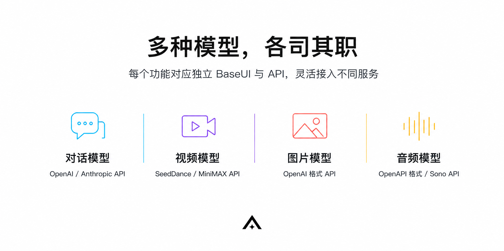
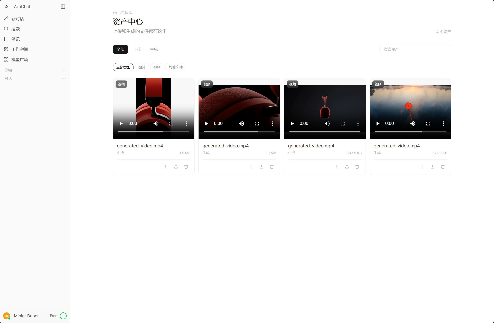

<div align="center">


# ArtiChat

[](https://github.com/PYBu/ArtiChat/)

**Enterprise-Grade Private AI Conversation Platform**

<kbd>Ready to Use</kbd> &nbsp; <kbd>Subscription Billing</kbd> &nbsp; <kbd>Multimodal Generation</kbd> &nbsp; <kbd>Experience Optimized</kbd> &nbsp; <kbd>Enterprise Ready</kbd> &nbsp; <kbd>Enhanced Edition</kbd>

<br/>

[](https://github.com/PYBu/ArtiChat/releases)
[](https://www.docker.com/)
[](https://kit.svelte.dev/)
[](https://fastapi.tiangolo.com/)

[](https://chat.artivis.cc)

</div>

<br/>

> AriChat Dreammaker(0.3+) ProEdition | Current stable version: **ArtiChat ProEdition 0.3.0**. This update integrates video generation APIs, launches Asset Center, refactors memory and tool invocation states, and rewrites Chatpoint and billing systems. Verified direct upgrade from 0.1.7 and 0.2.x without intermediate versions. Upgrades automatically execute database migrations; for production environments, stop services and backup `artichat_data` before upgrading. Old versions cannot directly connect to data volumes migrated to 0.3.0.

## 📚 &nbsp;Documentation

<div align="center">

[](apiuse.md)
&nbsp;&nbsp;
[](readme.md)

</div>

<br/>

## Introduction

ArtiChat is a private AI conversation and creation platform deeply customized and refactored by **Artivis Studio** based on [OpenWebUI](https://github.com/open-webui/open-webui). Built on powerful conversational capabilities, ArtiChat introduces a complete **subscription billing system**, **user permission management**, **multimodal media generation**, and **user experience optimization**, helping teams or SaaS products quickly build a self-controlled AI service, suitable for most large model distribution billing commercialization and enterprise/team internal model usage.

<br/>


---

<br/>

<table>
<tr>
<td width="50%" valign="top">

**🎬 &nbsp;Video Generation**

Generate videos directly in conversation without leaving the platform:

- Integrated **MiniMax** · **Seedance** video model APIs
- Models callable on-demand during conversation
- API keys visually configured in admin panel, no environment variable changes needed

</td>
<td width="50%" valign="top">

**🗂️ &nbsp;Asset Center**

Unified destination for all files, managing uploads and generations in one place:

- Centrally store uploaded images, videos, and documents
- Automatically archive model-generated media assets
- Generate shareable links with one click for external access

</td>
</tr>
<tr>
<td width="50%" valign="top">

**💳 &nbsp;Subscription & Billing System**

Chatpoint credit system and billing completely rewritten, covering full inference and media pipeline:

- Four token types with fine-grained pricing: **Input** · **Output** · **Cache Create** · **Cache Read**
- Independent media generation pricing, separate auditing for image and video usage
- Gift cards & redemption codes issuance and verification
- Usage auditing, Chatpoint consumption details available anytime

</td>
<td width="50%" valign="top">

**⚡ &nbsp;Reasoning Intensity Control**

Intelligent scheduling control for advanced models:

- Five intensity levels: **Low → Balanced → High → Ultra → Max**
- Optimized for Claude and Codex series
- One-click switching, no configuration changes needed

</td>
</tr>
<tr>
<td width="50%" valign="top">

**🧠 &nbsp;Active Memory**

Memory logic refactored, shifting from passive recording to active understanding:

- Models proactively capture user habits and preferences
- Memory entries automatically reviewed, deduplicated, and merged to avoid redundancy
- No manual input needed, conversation naturally accumulates

</td>
<td width="50%" valign="top">

**🔧 &nbsp;Tool Invocation Status**

Tool execution process visible, status text freely customizable:

- Invocation status displayed in real-time in conversation flow
- Custom status text for each tool
- Transparent execution process, no longer a black box

</td>
</tr>
<tr>
<td width="50%" valign="top">

**👥 &nbsp;Permission Management (RBAC)**

Flexible multi-level role system with precise access control:

- Multi-level user groups and role assignment
- Email verification registration process
- Fine-grained permission control for models and features

</td>
<td width="50%" valign="top">

**🛒 &nbsp;Model Marketplace**

Unified model portal clearly presenting resource information:

- Centralized display of all available models
- Show pricing and access conditions for each model
- User self-service model package subscription

</td>
</tr>
<tr>
<td width="50%" valign="top">

**🎨 &nbsp;White Label Customization**

Deployment equals branding, zero-code appearance replacement:

- Platform name, logo visually configurable
- About page content fully customizable
- Suitable for independent SaaS brand operations

</td>
<td width="50%" valign="top">

**🐳 &nbsp;Ready to Use**

Minimal deployment, focus on business not operations:

- Single-command Docker Compose startup
- Ollama dependency removed, lighter image
- Full-stack SvelteKit + FastAPI + SQLAlchemy

</td>
</tr>

<tr>
<td width="50%" valign="top">

**🧩 &nbsp;ACPlugin Center**

Equip models with callable tools, capability boundaries defined by you:

- Support custom plugin upload and use, no main program code changes needed
- Built-in **ACPlugin** directory: Artivis official plugins + certified community plugins, one-click install
- Plugins dedicated to model tools, called by models on-demand during conversation

</td>
<td width="50%" valign="top">

**📦 &nbsp;Image Distribution**

Uploaded to GHCR and DockerHub, pull and deploy:

- Official images published, no local build required
- Single `docker pull` command to complete
- [GHCR](https://github.com/PYBu/ArtiChat/pkgs/container/artichat) · [DockerHub](https://hub.docker.com/r/minier/artichat)

</td>
</tr>

</table>

---

## 📸 &nbsp;Interface Preview

<br/>

<table>
<tr>
<td width="50%">


</td>
<td width="50%">


</td>
</tr>
<tr>
<td width="50%">


</td>
<td width="50%">


</td>
</tr>
<tr>
<td width="50%">


</td>
<td width="50%">


</td>
</tr>
</table>

<br/>

<table>
<tr>
<td width="50%">


</td>
<td width="50%">


</td>
</tr>
<tr>
<td width="50%">


</td>
<td width="50%">


</td>
</tr>
</table>

<br/>


<br/>


<br/>


<br/>


<br/>

<br/>



<br/>

---

## 🎨 &nbsp;Design Details

Adding a touch of design delight to every little detail.

<br/>

<table>
<tr>
<td width="50%" align="center" valign="top">

**Circular Credit Component**

Intuitively displays remaining credits, usage status at a glance.
<br>
 -Suggested by Minier Buper.


</td>
<td width="50%" align="center" valign="top">

**Reasoning Intensity Animation**

Five-level intensity switching with smooth transition effects, operation provides immediate feedback.
<br>
 -Inspired by Codex/CC intensity animation.


</td>
</tr>
</table>

<br/>

---

## 💬 &nbsp;Feedback

Every iteration of ArtiChat comes from real user voices. If you encounter bugs, have feature ideas, or just want to discuss your experience—welcome to our feedback site and tell us, we look forward to hearing from the community and users! This project has gone through multiple version iterations and may have some bugs, but I will continue to update it!

<div align="center">

<br/>

[](https://chatbug.artivis.cc)

<br/>

</div>

---

## 🚀 &nbsp;Quick Deployment

### Requirements

| Dependency | Version |
|:-----|:--------|
| Docker | 20.10+ |
| Docker Compose | v2.x (Optional, Compose deployment only) |
| Server Memory | ≥ 2 GB (Recommended 4 GB+) |
| Network | Access to target AI API |

<br/>

### Option 1: Official Image (Recommended)

Images published to GHCR and DockerHub, no repository cloning or local building needed, pull and use. Both repositories contain the same image, choose either:

| Repository | Image Address |
|:-----|:--------|
| GHCR | `ghcr.io/pybu/artichat:latest` |
| DockerHub | `minier/artichat:latest` |

```bash
docker run -d \
  --name artichat \
  -p 3000:8080 \
  -v artichat_data:/app/backend/data \
  -e OPENAI_API_BASE_URL=https://your-api-endpoint/v1 \
  -e OPENAI_API_KEY=sk-xxxxxx \
  --restart unless-stopped \
  ghcr.io/pybu/artichat:latest
```

Or use Compose, create a new `docker-compose.yaml`:

```yaml
services:
  artichat:
    image: ghcr.io/pybu/artichat:latest
    container_name: artichat
    ports:
      - "3000:8080"
    volumes:
      - artichat_data:/app/backend/data
    environment:
      - OPENAI_API_BASE_URL=https://your-api-endpoint/v1
      - OPENAI_API_KEY=sk-xxxxxx
    restart: unless-stopped

volumes:
  artichat_data:
```

```bash
docker compose -p artichat up -d
```

> 💡 `latest` always points to the latest stable version. For production environments requiring version locking, replace the tag with a specific version number (e.g., `:0.3.0`) for easy rollback. To upgrade, just pull the new tag and rebuild the container, the `artichat_data` volume will be automatically retained.

<br/>

### Option 2: Build from Source

Use when you need to modify code yourself, first build takes about 3–5 minutes:

```bash
# 1. Clone repository
git clone https://github.com/PYBu/ArtiChat.git
cd ArtiChat

# 2. Build and start
docker compose -p artichat up -d --build artichat
```

<br/>

### After Startup

Visit **[http://localhost:3000](http://localhost:3000)**, first entry allows administrator account initialization.

Health check:

```bash
curl http://localhost:3000/health
# {"status":true}
```

<br/>

### Upgrading from Old Versions

0.3.0 supports direct upgrade from released 0.1.7 and 0.2.x without intermediate versions. Regardless of deployment method, stop writes and backup the named volume first:

```bash
docker compose -p artichat stop artichat
docker run --rm \
  -v artichat_data:/source:ro \
  -v "$PWD":/backup \
  alpine sh -c 'tar -C /source -czf /backup/artichat-pre-0.3.0-backup.tar.gz .'
```

After backup completes, choose the corresponding upgrade command based on deployment method.

Image deployment:

```bash
docker compose -p artichat pull
docker compose -p artichat up -d
curl http://localhost:3000/ready
```

Source deployment:

```bash
git pull --ff-only origin main
docker compose -p artichat up -d --build artichat
curl http://localhost:3000/ready
```

Resume external traffic after confirming `/ready` returns `{"status":true}`. For rollback, restore the pre-upgrade archive to a clean data volume before starting the old version; do not let the old version directly read a data volume already migrated to 0.3.0.

<br/>

### Production Environment Configuration

| Parameter | Description | Default |
|:-----|:-----|:------|
| `WEBUI_SECRET_KEY_FILE` | Persistent session key file | `/app/backend/data/.webui_secret_key` |
| `WEBUI_SECRET_KEY` | Optional explicit session key; must remain unchanged long-term once set | Not set |
| `CORS_ALLOW_ORIGIN` | CORS origin whitelist | `*` (insecure) |
| `DATABASE_URL` | Database connection string | SQLite local file |
| `OPENAI_API_BASE_URL` | OpenAI compatible API address | — |
| `OPENAI_API_KEY` | Corresponding API key | — |

> 💡 Docker Compose generates and reuses session key file in data volume by default. Production environments must persist this file or set a long-term unchanging `WEBUI_SECRET_KEY`, and tighten `CORS_ALLOW_ORIGIN` from default `*` to actual domain.

<br/>

---

## 🗺️ &nbsp;Major Update Milestones

```
-ArtiChat Basement(0.1+)
v0.1.3  ✅  Complete ArtiChat content rebuild, distinguished from OpenWebUI as a branch.
-ArtiChat BasementPlus(0.1.7)
v0.1.7  ✅  Foundation adaptation and modification, reinforcement and ArtiChat stable operation.
-ArtiChat ProEdition(0.2+)
v0.2.0  ✅  Systematic upgrade, ArtiChat components and UI rebuild, prioritizing new features and user experience.
-ArtiChat ProEdition Dreammaker(0.3+)
v0.3.0  ✅  Entering multimodal: video generation APIs and Asset Center launched, memory and tool invocation state refactored, Chatpoint and billing system rewritten, numerous code refactored to accommodate ArtiChat features.

v0.4.0  🔜  ArtiChat-LINK — Local MCP integration, enabling models to directly control PowerShell and local system resources, achieving true "web-based Codex"
```

<br/>

---

## 🛠️ &nbsp;Tech Stack

<div align="center">

| Layer | Technologies |
|:----:|:--------|
| **Frontend** | SvelteKit · TypeScript · Tailwind CSS · Vite |
| **Backend** | FastAPI · SQLAlchemy · Python 3.11+ |
| **Base Platform** | OpenWebUI 0.11.0 |
| **Containerization** | Docker · Docker Compose |

</div>

<br/>

---

## 🙏 &nbsp;Acknowledgments

Thanks to the following projects and communities for their support and inspiration for ArtiChat:

[**OpenWebUI**](https://github.com/open-webui/open-webui) — ArtiChat's base platform, providing powerful conversational interface and engineering foundation

<br/>

---

## 📄 &nbsp;Open Source Declaration

This project is a secondary development based on [OpenWebUI](https://github.com/open-webui/open-webui), following its license agreement. Upstream copyright and license information is retained in [`LICENSE`](LICENSE), [`LICENSE_NOTICE`](LICENSE_NOTICE), and [`LICENSE_HISTORY`](LICENSE_HISTORY).
<br/>

> ⚠️ **Commercial Deployment Notice** — For more than 50 users or commercial use, please follow the [OpenWebUI License Agreement](https://github.com/open-webui/open-webui/blob/main/LICENSE) and obtain authorization from OpenWebUI officially.
---

<div align="center">

-Built with ❤️ by &nbsp;<strong>Artivis Studio</strong> | <b>Art</b> W<b>i</b>th <b>Vis</b>ion | Design By <b>Minier Buper (PYBu)</b>-

</div>
